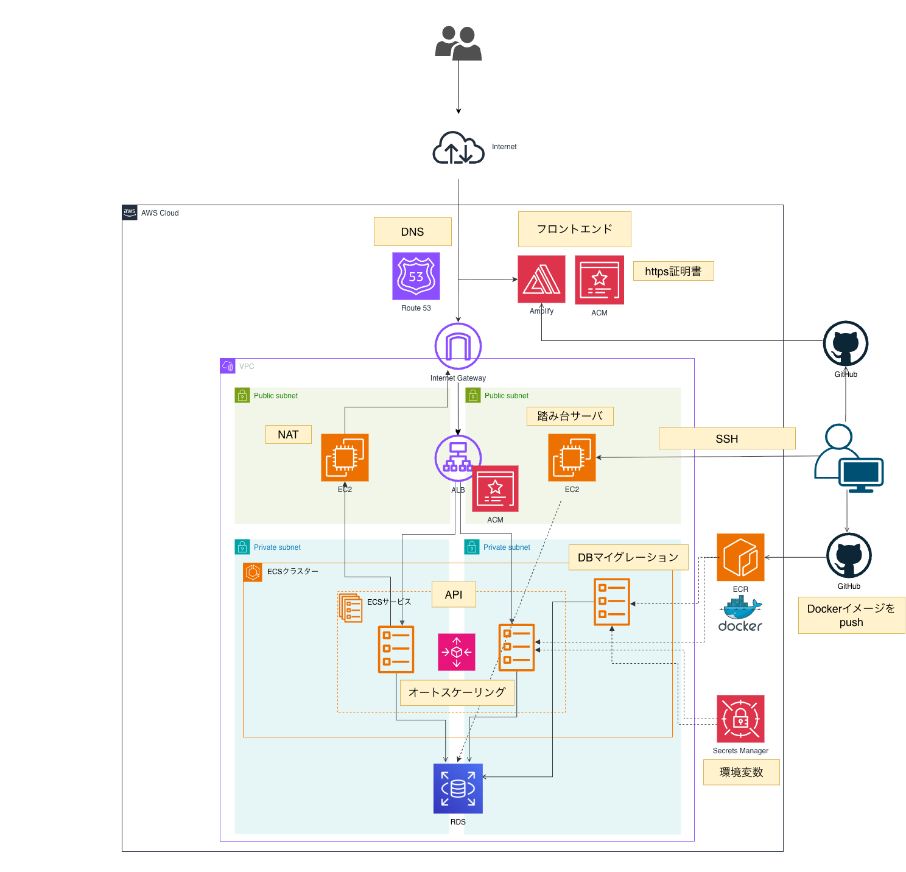

# Scene Speak

**話したいシーンで、話せるようになる。— シーン別 英会話学習アプリ**

Scene Speak は、空港・レストラン・商談など「実際に使う場面（シーン）」ごとに英会話を練習できる学習アプリです。本リポジトリはそのフロントエンド（Next.js）です。

> API サーバー（バックエンド）は別リポジトリで管理しています 👉 [H-F025/scene-speak-api-server](https://github.com/H-F025/scene-speak-api-server)

---

## 📖 アプリ概要

> アプリURL 👉 http://scene-speak.com

日常会話からビジネス英語まで、実践的なシーンに紐づいた選択式の会話問題を解いていく英語学習アプリです。

- あなたの英語レベル（初級 / 中級 / 上級）に合わせてテーマを出題
- 回答するとその場で正誤と解説を表示。「なぜ間違えたのか」まで理解してから次へ進める
- 間違えた問題は **苦手問題ノート（復習セット）** に自動で蓄積され、ピンポイントで復習できる
- 学習時間・正答率・連続学習日数を記録し、積み上げを可視化してモチベーションを維持

## 💡 サービスを作った背景

単語帳や例文の丸暗記中心の学習では、「いざその場面になると言葉が出てこない」という課題があります。Scene Speak は次の 2 点を狙って開発しました。

- **シーンに紐づけて学ぶ** ことで、丸暗記ではなく「使える英語」を身につける
- **その場で理解し、苦手を自動で復習** できる仕組みで、学習を無理なく継続させる

## ✨ 主な機能

| 機能                  | 概要                                                               | 実装 (`src/features/`)         |
| --------------------- | ------------------------------------------------------------------ | ------------------------------ |
| 認証                  | メールアドレス登録 / ログイン / ゲストログイン                     | `auth`                         |
| ホーム                | 連続学習日数・本日の学習時間・今日のおすすめテーマ・復習セット導線 | `home`                         |
| テーマ選択            | 英語レベル別タブでシーン（テーマ）を選択                           | `themes`                       |
| 問題演習              | シーン別の選択式会話問題、進捗表示付き                             | `practice`                     |
| フィードバック        | 回答直後に正誤・解説を表示、AI への質問導線                        | `feedback`                     |
| 苦手問題ノート / 復習 | 間違えた問題を復習セットとして蓄積・復習                           | `weakness-workbook` / `review` |
| 学習履歴              | 月別の学習記録・正答率・学習時間サマリ                             | `history`                      |
| 学習セッション計測    | heartbeat による学習時間トラッキング                               | `learning-session`             |
| アカウント設定        | 英語レベルの変更 / マイページ                                      | `account`                      |

## 🛠 技術スタック

| 分類                        | 使用技術                                                                   |
| --------------------------- | -------------------------------------------------------------------------- |
| フレームワーク              | Next.js 15.5（App Router / Turbopack）, React 19, TypeScript 5             |
| スタイリング                | Tailwind CSS v4, shadcn/ui, Base UI, lucide-react, next-themes             |
| データ取得                  | TanStack Query v5, axios（Cookie ベース認証 / cookies-next）               |
| フォーム / バリデーション   | React Hook Form, Zod                                                       |
| コード品質                  | ESLint 9, Prettier, Husky, lint-staged, commitlint（Conventional Commits） |
| パッケージ管理 / ランタイム | pnpm 9.15, Node.js 22.22                                                   |
| 開発環境                    | Docker（`compose.yml`）                                                    |

## 🧱 アーキテクチャ / ディレクトリ構成

feature ベースの構成を採用し、機能ごとに関連コードを凝集させています。

```
src/
├── app/         # App Router のルーティング層（(auth) / (main) グループ）
├── features/    # 機能単位のモジュール（types / constants / schemas / api / hooks / components）
├── shared/      # 横断的なユーティリティ・プロバイダ・型・スタイル
└── components/  # UI プリミティブ（ui）とアイコン（icons）
```

- `@/*` エイリアスで絶対パス import が可能
- 各画面の表示文言（メッセージ・ラベル）は **バックエンドを SSoT（信頼できる唯一の情報源）** とし、フロントで固定文言を極力持たない方針

## 🔌 バックエンド（API サーバー）

API サーバーは別リポジトリで開発しています。

- リポジトリ: **<https://github.com/H-F025/scene-speak-api-server>**
- 本フロントエンドは環境変数 `NEXT_PUBLIC_API_URL`（デフォルト `http://localhost:8080`）経由で API に接続します
- 認証は Laravel Sanctum のセッション Cookie を利用。加えて認証状態の存在判定用に marker cookie（`scenespeak-auth`）を分離管理しています

## 🏗 インフラ構成図



- **フロントエンド**: AWS Amplify でホスティング（ACM による HTTPS 証明書、Route 53 で DNS）。GitHub への push をトリガーに自動デプロイ
- **API サーバー**: VPC 内の ECS（Fargate）+ ALB で稼働し、オートスケーリングに対応。DB は RDS
- **CI/CD・運用**: Docker イメージを ECR に push、Secrets Manager で環境変数を管理、踏み台サーバー（EC2）経由で運用・DB マイグレーションを実施

## 🚀 ローカル環境構築

### 前提

- Node.js `22.22.3`（`.nvmrc` 参照）
- pnpm `9.15.4`

### セットアップ

```bash
# 依存関係のインストール
pnpm install

# 環境変数ファイルを用意
cp .env.example .env.local

# 開発サーバー起動（http://localhost:3000）
pnpm dev
```

Docker で起動する場合:

```bash
docker compose up
```

### 主要スクリプト

| コマンド          | 内容                          |
| ----------------- | ----------------------------- |
| `pnpm dev`        | 開発サーバー起動（Turbopack） |
| `pnpm build`      | 本番ビルド                    |
| `pnpm start`      | 本番サーバー起動              |
| `pnpm lint`       | ESLint 実行                   |
| `pnpm type-check` | 型チェック（`tsc --noEmit`）  |
| `pnpm format`     | Prettier で整形               |

---

© Scene Speak
